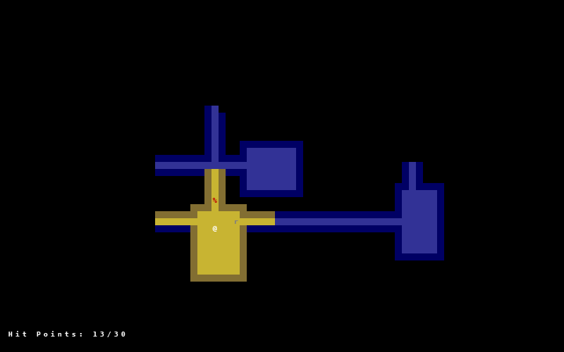

## What is this?
A simplistic roguelike that leverages the [python-tcod](https://github.com/libtcod/python-tcod) library. This application was created by following the [Yet Another Roguelike Tutorial](https://rogueliketutorials.com/tutorials/tcod/v2).

Features:
* The map is generated each time the application is run
* The rest of the map is revealed when you move around and explore
* You can only see tiles around your character in a certain radius (field of view)
* You can fight monsters and they can fight you

## In-game Example

## How do I install and run this?
1. Clone the project: `git clone https://github.com/captain-chen/pyrogue.git` and then change into the directory
2. Install the required dependencies using pip: `python pip install -r requirements.txt`.
3. Start the game: `python main.py`